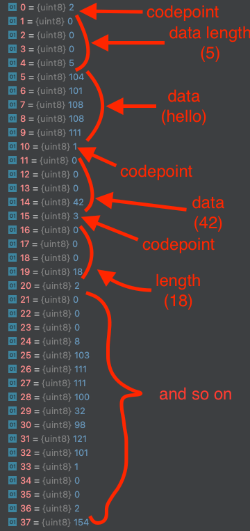

# Problem statement
We're asked to build a simple encoding algorithm of a `Data` object to a string. `Data` is an array of items which can be 3 kinds of types: 
strings, int32 or another Data object. Formally `Array<string | int32 | Data>` e.g
```
["foo", ["bar", 42]]
```

# Implementation

Implementation is in the `custom_encoder.go` file.
Given that the data items can be 1 of 3 types (string | int32 | Data), my approach is to encode Data into a byte "blobs" as follows:

1) Map the item types to a byte marker in the following manner
    * `int` -> `0x1`
    * `string` -> `0x2`
    * `Data` -> `0x3`
2) When encoding, 
   1) loop over the data items
   2) for each, write the corresponding byte marker for that type to a byte array buffer (1 byte)
   3) write the length of the data as int32 (4 bytes)
   4) write the data as bytes
3) When decoding, 
   1) read the first byte to determine the type
   2) read the next byte to determine the data length (n)
   3) read the next n bytes of data and convert to the corresponding type

With the following notes:
1) everything is big endian
2) When reading/writing a `Data` object, its encoded byte length and data is calculated/built recursively. So if we deeply nest Data objects, and encode them, the stack might explode. If this is hard stop the recursive calls can be converted to iterative ones, with an extra datastructure (probably a stack).
3) When writing `int` blobs, we know it will always be 4 bytes, so we don't need to write the length.


### int32 byte blob

| Bytes       | 1          | 2 .. 5       |
| :---------- |------------|--------------|
| **Purpose** | type (0x1) | data (int32) |

### string blob
| Bytes       | 1          | 2 .. 5   | 6 .. **n**        |
| :---------- |------------|----------|---------------|
| **Purpose** | type (0x2) | length **n** | data (string) |

### Data blob
| Bytes       | 1          | 2 .. 5   | 6 .. **n**  |
| :---------- |------------|----------|-------------|
| **Purpose** | type (0x3) | length **n** | data (Data) |


As an example the following Data would have this []byte encoding
```
["hello", 42, ["good bye", 666]]

```


## Performance / Thoughts
As far as complexity this will not exceed O(n * m) runtime where `n` is the number of data items, and `m` is the number of
nested `Data` items. Quadratic complexity is obviously not great, but I think it would be reasonable to limit the recursive
depth of such arrays, because a 1000 deep nested data model should be revisited. In practice I don't think we'd ever see that.

As for memory, it grows linearly with amount of data, which is reasonable I think. 
1) For each int, we add 1 byte overhead for the type, 4 bytes for the int
2) For each string, we add 1 byte overhead for the type, and 4 bytes for the length
3) For each Data, we also add 1 byte overhead for the type and 4 bytes for the length

Also, I think that instead of returning a `string`, the encoding could just return a byte array directly, and avoid the need
to encode the bytes back to a UTF-8 string. Probably saves some time and memory there.

I wasn't sure at first if we could use a 3rd party lib (not part of the language), so I had written a encoder using protobuf which
I left in the repo. Honestly if this was for work I'd probably leverage an existing solution like protobuf, thrift or msgpack. Json could be viable for mvp but obviously not ideal long term.

I think also there's a way to optimize even further by avoiding sending 4 bytes for the length/int, and use a terminating byte
to indicate when the data should be chunked.

And the implmentation could probably reuse a lot of buffers 

## Code

* `interface.go`  interface for encode/decode
* `data.go` model for the `Data` object with a toString and method to calculate encoded byte size
* `custom_encoder.go` custom implementation of the encode/encode

## Binaries
There's binaries built for linux/darwin amd64 that just run the encode/decode loop and print the input/output.
Sorry windows users... JUST KIDDING there's an .exe in there for you as well :-)
